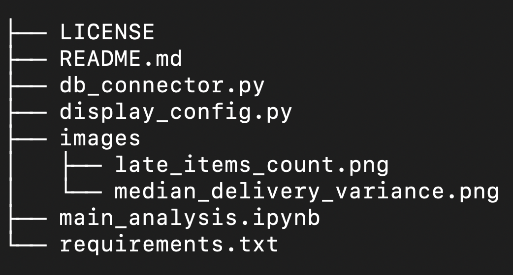
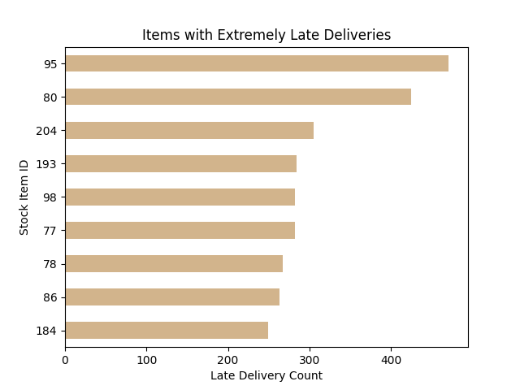
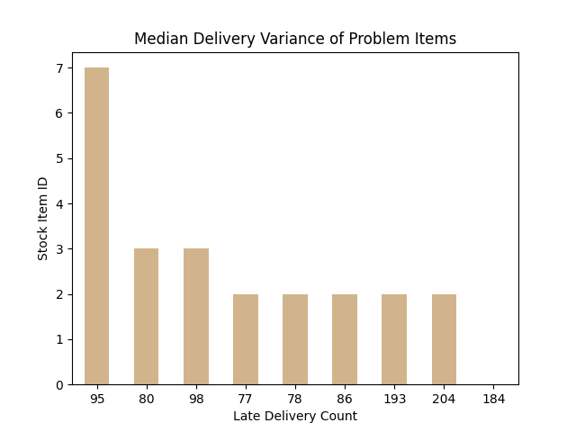

# Pandas Exploration of Wide World Importers

## Objective
This project is a self-led exploratory data analysis of the Wide World Importers dataset. The plan was to gradually wad into the data to discover a business problem, generate a business question from it, and answer that question through descriptive and diagnostic analysis.

## Executive Summary: Delivery Delays — Root Cause & Fix

**Problem**: 6,041 invoice lines were delivered ≥3 days late  
**Root Cause**: **100%** of delays were from **9 stock items**, all packaged as **"Each"**  
**Fix**: Audit these 9 SKUs and items with "Each" UOM for delivery forecasting, special handling, and SLA issues to **eliminate all unacceptably late deliveries**

* Late Deliveries: 6,041
* Problem SKUs: 9
* Median Delay (Top Item): **7 days**

---

## Environment Setup and Configuration

These instructions ensure the project is run in a secure, isolated environment, adhering to professional standards for dependency management and credential handling.

### 1. Prerequisites (Assumed Tools)

Users are expected to have the following tools installed and accessible via their terminal:

* **PostgreSQL:** Database software (version 17.6 recommended).
* **Python:** Version 3.13.3 (manageable via `pyenv`).
* **JupyterLab:** The environment where the analysis notebook will be executed.

---

### 2. Clone the Project Repository
To get all the necessary files, including the analysis notebook and supporting Python modules, clone the entire repository:
`git clone https://github.com/hunter-sills/wwi_performance_discovery.git`
`cd wwi_performance_discovery`

Alternatively, you can download the repository as a ZIP file and extract the contents to a local folder.

<p align="center">
  
</p>


---

### 3. Python Environment Setup (macOS/Linux Terminal)

Use a standard virtual environment (`venv`) to isolate project dependencies.

1.  **Create and Activate the Virtual Environment:**

    ```bash
    # Create the environment in the project directory
    python3 -m venv venv

    # Activate the environment (macOS/Linux)
    source venv/bin/activate
    ```

    > **Note for Windows Users:** The activation command is typically `venv\Scripts\activate.bat`.

2.  **Install Dependencies:**

    Install all required Python packages (Pandas, `psycopg`, etc.) using the provided `requirements.txt` file:

    ```bash
    pip install -r requirements.txt
    ```

3.  **Launch JupyterLab:**

    Start the JupyterLab server from within the active environment to begin the analysis.

    ```bash
    jupyter lab
    ```

---

### 4. Database Credentials and Security Config

This project uses the `python-dotenv` library to load credentials securely from a file that is not committed to version control.

1.  **Create the `.env` File:**

    Create a file named **`.env`** directly in the project's root directory. **Ensure this file is listed in your `.gitignore` and is NOT committed to GitHub.**

2.  **Populate Credentials:**

    The `db_connector.py` module expects the following PostgreSQL credentials. Reviewers must replace the bracketed values with their own local credentials:

    ```ini
    # .env file (DO NOT COMMIT)
    DB_DIALECT="postgresql+psycopg"
	DB_PORT="5432"
	DB_HOST="localhost"
    DB_NAME="wide_world_importers"
    DB_USER=[your_postgres_user]
    DB_PASSWORD=[your_postgres_password]
    ```

---

### 5. Data Loading into PostgreSQL (Wide World Importers)

This project utilizes the **Wide World Importers Data Warehouse (DW)** dataset. It is installed using the PostgreSQL custom restore utility (`pg_restore`) which is optimized for large data dumps.

These steps assume the PostgreSQL service is running and you have created an empty database named `wide_world_importers`.

**Preparation and File Download**

1. **Follow this link:** [Wide World Importers (Azure PostgreSQL Sample)](https://github.com/Azure/azure-postgresql/tree/master/samples/databases/wide-world-importers)
2.  **Download the Dump File:** Download the full, compressed **WWI PostgreSQL dump file** (e.g., `wide_world_importers_pg.dump`) and save it to a secure, accessible location (e.g., `data/dumps/`).

**Restore the Database**

Use the `pg_restore` command to load the custom dump file into your empty `wide_world_importers` db.

```bash
# Connects to localhost, uses username from .env, prompts for PostgreSQL password, and restores to wide_world_importers
pg_restore -h localhost -p 5432 -U ${DB_USER} -W -v -Fc -d m wide_world_importers /path/to/your/wide_world_importers_pg.dump
```

Note on Errors: The restoration may produce errors related to the azure_superuser role. These are harmless ownership issues from the dump's origin and will not prevent the data or tables from loading successfully.


---

### 6. Running the Analysis

Once the database is loaded and the environment is active:

1.  Open the main analysis notebook (`wide_world_importers.ipynb`) via JupyterLab.
2.  Run all cells sequentially. Cells 3, 4, and 5 will establish the database connection and execute the three `pd.read_sql()` queries.

---

## Analysis & Key Findings

The initial summary statistics on my metric columns revealed an extremely long max delivery delay -- 1,114 days. That prompted me to create an outlier flag for the delivery_variance_days column based on a hypothetical business rule, flagging delivery delays of 3 days or more.

I wanted to know more about these unacceptably late deliveries. The initial business question was:
**"What segmentation of this data will give more insight into the extremely late deliveries?"**

I identified the categorical columns in my source data suitable for grouping to identify segments that would highlight the late deliveries. Wherever a categorical column "slice" showed high rates of late deliveries, that would be the starting point for further analysis.

Grouping late deliveries by the stock_item_id column showed a high concentration. So the follow-up question became: 
**"Which stock items have the most extremely late deliveries?**

I counted the invoice lines where deliveries were late for each stock item, then removed items with no late deliveries. The result was a list of 9 items that accounted for all of the unacceptable delivery delays.



To add some detail on the severity of delays for each item, I calculated and plotted the median delivery variance for each of those items.



## Initial Summary Analysis

**Discovered Performance Driver:**  
Nine stock items account for all extremely late deliveries:
* IDs:  `95`, `80`, `204`, `193`, `77`, `98`, `78`, `86`, `184`  
  * ID `95` is routinely late by a full week or more  
  * ID `184` is only infrequently late by an extreme amount

My next business question became:
**"What is special about these nine stock items that causes such long delivery delays?"**

I isolated the problem items in their own table and performed a similar clustering operation, frouping by three category or metic columns I thought might explain the delayed deliveries. Sales territory and average quantity per order line did not reveal any clustering, but the package_type_name (proxy for UOM) revealed that ALL of the items were sold as "Each".

---

## Conclusion & Recommendations

### Diagnostic Drill-Down  

**Root Cause:**
* All 6,041 unacceptably late deliveries involve stock items sold in "Each" units.

**Evidence:**
* `package_type_name == "Each"`: 6,041 unacceptably late deliveries
* All other types (`Bag`, `Packet`, `Pair`): 0 unacceptably late deliveries
*  No concentration among territories (Southeast leads but doesn't indicate anomaly)

**Secondary Question Answered:**
* What is special about these nine stock items?
--> They are all sold in "Each" units — so "Each" packaging causes 100% of unacceptably late deliveries.

### Recommended Actions  

Since estimated delivery dates are calculated after the order is placed,  
the delivery failures are not a factor of upstream issues like vendor delays or stocking issues.
1. Audit 9 SKUs for delivery forecasting issues
  * Owner: Supply Chain
2. Review "Each" packaging: Do they require special handling? Is it an issue of fragility?
  * Owner: Logistics
3. Add UOM-based SLA for "Each" items and monitor proactively
  * Owner: Operations

---

**Business Impact**:  
* Fixing these 9 items will eliminate all unacceptably late deliveries.
